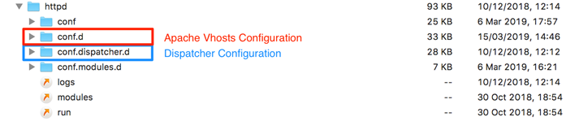
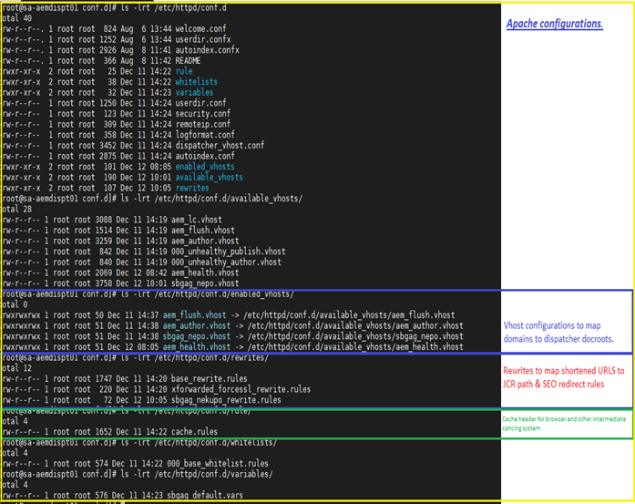
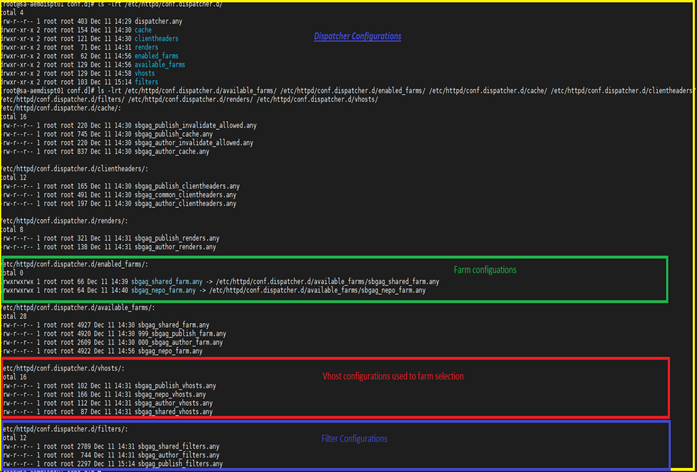

# dispatcher-configurations
AEM Dispatcher Configuration for multiple hosts

# Modules

The main parts of the project are:

* dispatcher: Dispatcher configurations

## How to build

To build all the modules run in the project root directory the following command with Maven 3:

    mvn clean install -PautoInstallPackage

### Unit tests

This show-cases classic unit testing of the code contained in the bundle. To
test, execute:

    mvn clean test

## Maven settings

The project comes with the auto-public repository configured. To setup the repository in your Maven settings, refer to:

    http://helpx.adobe.com/experience-manager/kb/SetUpTheAdobeMavenRepository.html

# How to add your configuration

## Overview 
Here is an overview of the apache/dispatcher configuration sructure. Apache modifications have been made only in conf.d and conf.dispatcher.d folders:

It is a multi-tenant environment and multiple sites are hosted in the same author and publish instances. 
Those sites have their own content, hence caching configuration is also splitted.  
Below is the structure of dispatcher docroot where website have their own docroot for the content pages and a shared folder used for resources (images, css, js, …)



It is a multi-tenant environment and multiple sites are hosted in the same author and publish instances. 
Those sites have their own content, hence caching configuration is also splitted.  
Below is the structure of dispatcher docroot where website have their own docroot for the content pages and a shared 
folder used for resources (images, css, js, …)


## Configurations

### Apache Configurations



The Vhosts are configured in the folder /conf.d/available_vhosts and activated by creating a symbolic link to /conf.d/enabled_vhosts.

The Vhosts define the docroot where the content must be pulled from and the rewrite file where the mappings rules are set. 
Here is an example of a Vhost file :

```
 ## Collect any enviromental variables that are set in /etc/sysconfig/httpd
 ## Collect the dispatchers number 
 PassEnv DISP_ID 
       
 <VirtualHost *:80> 
  ServerName web
  ServerAlias www.program-pandit.com
  
  DocumentRoot ${WEBSITE_DOCROOT}  

  <IfModule mod_headers.c>   
         Header always add X-Dispatcher ${DISP_ID} 
          Header always add X-Vhost "publish" 
         Header merge X-Frame-Options SAMEORIGIN "expr=%{resp:X-Frame-Options}!='SAMEORIGIN'" 
         Header merge X-Content-Type-Options nosniff "expr=%{resp:X-Content-Type-Options}!='nosniff'" 

        Header append Vary User-Agent env=!dont-vary  #### Make sure proxies don't deliver the wrong content 
 
 ## Redefine Host for farm selection
         SetEnvIfNoCase Request_URI ^/content/campaigns hostnameforfarm=shared 
         SetEnvIfNoCase Request_URI ^/content/dam hostnameforfarm=shared 
         SetEnvIfNoCase Request_URI ^/etc hostnameforfarm=shared 
         SetEnvIfNoCase Request_URI ^/apps hostnameforfarm=shared 
         SetEnvIfNoCase Request_URI ^/libs hostnameforfarm=shared 
         SetEnvIfNoCase Request_URI ^/var hostnameforfarm=shared 
         RequestHeader set Host %{hostnameforfarm}e env=hostnameforfarm 
     </IfModule> 
     <Directory /> 
         ## Update /etc/sysconfig/httpd with setting the PUBLISH_WHITELIST_ENABLED from 0 or 1 to enable or disable ip restriction rules 
         <If "${PUBLISH_WHITELIST_ENABLED} == 1"> 
             Include /etc/httpd/conf.d/whitelists/*_whitelist.rules 
         </If> 
         <IfModule disp_apache2.c> 
             ## Some items cache with the wrong mime type 
             ## Use this option to use the name to auto-detect mime types when cached improperly 
             ModMimeUsePathInfo On 
             ## Use this option to avoid cache poisioning 
             ## Sling will return /content/image.jpg as well as /content/image.jpg/ but apache can't search /content/image.jpg/ as a file 
             ## Apache will treat that like a directory.  This assures the last slash is never stored in cache 
             DirectorySlash Off 
             ## Enable the dispatcher file handler for apache to fetch files from AEM 
             SetHandler dispatcher-handler 
         </IfModule> 
         Options FollowSymLinks 
         AllowOverride None 
         #### Insert filter 
         SetOutputFilter DEFLATE 
        #### Don't compress images 
                 SetEnvIfNoCase Request_URI \ 
         \.(?:gif|jpe?g|png)$ no-gzip dont-vary 
     </Directory> 
     <Directory "${WEBSITE_DOCROOT}"> 
         AllowOverride None 
         Require all granted 
     </Directory> 
     <Location /> 
         AuthType Basic 
         AuthName "Restricted Content" 
         AuthUserFile /etc/httpd/conf.d/.htpasswd 
         Require valid-user 
     </Location> 
     <IfModule disp_apache2.c> 
         ## Enabled to allow rewrites to take affect and not be ignored by the dispatcher module 
         DispatcherUseProcessedURL   1 
         ## Default setting to allow all errors to come from the aem instance 
         DispatcherPassError     0 
     </IfModule> 
     <IfModule mod_rewrite.c> 
         ReWriteEngine   on 
         LogLevel warn rewrite:info 
         ##Global rewrite include 
         Include /etc/httpd/conf.d/rewrites/base_rewrite.rules 
     Include /etc/httpd/conf.d/rewrites/nekupo_rewrite.rules
         ## Update /etc/sysconfig/httpd with setting the PUBLISH_FORCE_SSL from 0 or 1 to enable or disable enforcing SSL 
        <If "${PUBLISH_FORCE_SSL} == 1"> 
             Include /etc/httpd/conf.d/rewrites/xforwarded_forcessl_rewrite.rules 
         </If> 
     </IfModule> 
 </VirtualHost> 

```

Here are highlighted properties:

 * Lines 6 - 8: List of domains mapped to this vhost. Requests to those domains will be served by this vhost.
 * Line 10: Set the docroot to serve the pages stored in the website docroot.
 * Lines 21 - 28: The Host header is redefined to route the request to the right farm (Website Farm or Shared Farm).
 * Line 75: Reference to the rewrite configuration of that vhost (see below).
 
Following the routing of requests between website and Shared resources, the same configuration is set for cache flushing. 
This configuration is set in the file aem_flush.vhost:

```
1.  ## Collect any enviromental variables that are set in /etc/sysconfig/httpd 
2.  ## Collect the dispatchers number 
3.  PassEnv DISP_ID 
4.  ## Use this vhost in conjunction with adding a Host Header (flush) to your AEM flush agent configurations so they fall into this host 
5.  ## This is a deliberate flush target that doesn't conflict with customers configurations of the dispatcher 
6.  <VirtualHost *:80> 
7.      ServerName  "dispflush" 
8.      ServerAlias flush 
9.      ## Use a doc root that matches what's in the /etc/httpd/conf/publish-farm.any 
10.     DocumentRoot    ${PUBLISH_DOCROOT} 
11.     ## Add header breadcrumbs for help in troubleshooting 
12.     <IfModule mod_headers.c> 
13.         Header always add X-Dispatcher ${DISP_ID} 
14.         Header always add X-Vhost "flush" 
15.          
16.         ## Set Host farm selection 
17.         SetEnvIfNoCase CQ-Path ^/content/dam hostnameforfarm=shared 
18.         SetEnvIfNoCase CQ-Path ^/content/campaigns hostnameforfarm=shared 
19.         SetEnvIfNoCase CQ-Path ^/etc hostnameforfarm=shared 
20.         SetEnvIfNoCase CQ-Path ^/var hostnameforfarm=shared 
21.         SetEnvIfNoCase CQ-Path ^/libs hostnameforfarm=shared 
22.         SetEnvIfNoCase CQ-Path ^/apps hostnameforfarm=shared 
23.         SetEnvIfNoCase CQ-Path ^/content/web hostnameforfarm=web 
24.             RequestHeader set Host %{hostnameforfarm}e env=hostnameforfarm 
25.     </IfModule> 
26.         <Directory "${PUBLISH_DOCROOT}"> 
27.                 AllowOverride None 
28.                 Require all granted 
29.         </Directory> 
30.     <Directory /> 
31.         <IfModule disp_apache2.c> 
32.             SetHandler dispatcher-handler 
33.         </IfModule> 
34.     </Directory> 
35.  
36. </VirtualHost> 
```
The lines 17 to 24 set the Host based on the path of the resource to activate a Farm or the Shared Farm (see farms configuration).


### Rewrites

Pages and resources are stored in the dispatcher docroots using their real AEM path. Such paths are not exposed to the public, 
hence shorten URLs are generally seen by the end users. To properly map those shortened URLs to real AEM path, 
rewrite rules are defined to apply transformation to the request before being handled by the dispatcher and AEM.

Here is an example of rewrite configuration
```
#
# Set default page
#
RewriteRule ^/$ /content/web/en.html [PT,L]  
#
# Add /content/web/de before passing through the dispatcher
#
RewriteRule ^/(.*)\.html$ /content/web/en/$html[PT]  
```
These rewrite rules allow end users to hit the “/content/web/de.html” page when they request the root domain 
(eg: http://www.programpandit.com) and hit the pages using shortened to serve /content/web/en.html”).

## Dispatcher Configurations

### Farms



The Farms are configured in the folder /conf.dispatcher.d/available_farms and activated by creating a symbolic link to /conf.dispatcher.d/enabled_farms.

The Farms define the dispatcher configurations for each website and one extra farm for the Shared Resources request. 
Here is an example of a farm:
```

1.  /webfarm {   
2.      ## client headers which should be passed through to the render instances 
3.      ## (feature supported since dispatcher build 2.6.3.5222) 
4.      /clientheaders { 
5.          $include "/etc/httpd/conf.dispatcher.d/clientheaders/publish_clientheaders.any" 
6.          $include "/etc/httpd/conf.dispatcher.d/clientheaders/common_clientheaders.any" 
7.      } 
8.      ## hostname globbing for farm selection (virtual domain addressing) 
9.      /virtualhosts { 
10.         $include "/etc/httpd/conf.dispatcher.d/vhosts/web_vhosts.any" 
11.     } 
12.     ## the load will be balanced among these render instances 
13.     /renders { 
14.         $include "/etc/httpd/conf.dispatcher.d/renders/publish_renders.any" 
15.     } 
16.     ## only handle the requests in the following acl. default is 'none' 
17.     ## the glob pattern is matched against the first request line 
18.     /filter { 
19.         $include "/etc/httpd/conf.dispatcher.d/filters/publish_filters.any" 
20.     } 
21.     ## if the package is installed on publishers to generate a list of all content with a vanityurl attached 
22.     ## this section will auto-allow the items to bypass the normal dispatcher filters 
23.     ## Reference: https://docs.adobe.com/docs/en/dispatcher/disp-config.html#Enabling%20Access%20to%20Vanity%20URLs%20-%20/vanity_urls 
24.     /vanity_urls { 
25.         /url    "/libs/granite/dispatcher/content/vanityUrls.html" 
26.         /file   "/tmp/vanity_urls" 
27.         /delay  300 
28.     } 
29.     ## allow propagation of replication posts (should seldomly be used) 
30.     /propagateSyndPost "0" 
31.     ## the cache is used to store requests from the renders for faster delivery 
32.     ## for a second time. 
33.     /cache { 
34.         ## The cacheroot must be equal to the document root of the webserver 
35.         /docroot "${web_DOCROOT}" 
36.         ## sets the level upto which files named ".stat" will be created in the  
37.         ## document root of the webserver. when an activation request for some  
38.         ## handle is received, only files within the same subtree are affected  
39.         ## by the invalidation. 
40.         /statfileslevel "4" 
41.         ## caches also authorized data 
42.         /allowAuthorized "0" 
43.         ## Flag indicating whether the dispatcher should serve stale content if 
44.         ## no remote server is available. 
45.         /serveStaleOnError "1" 
46.         ## the rules define, which pages should be cached. please note that 
47.         ## - only GET requests are cached 
48.         ## - only requests with an extension are cached 
49.         ## - only requests without query parameters ( ? ) are cached 
50.         ## - only unauthorized pages are cached unless allowUnauthorized is set to 1 
51.         /rules { 
52.             $include "/etc/httpd/conf.dispatcher.d/cache/publish_cache.any" 
53.         } 
54.         # the invalidate section defines those pages which are 'invalidated' after 
55.         # any activation. please note that, the activated page itself and all  
56.         # related documents are flushed on an modification. for example: if the  
57.         # page /foo/bar is activated, all /foo/bar.* files are removed from the 
58.         # cache. 
59.         /invalidate { 
60.             /0000 { 
61.                 /glob "*" 
62.                 /type "deny" 
63.             } 
64.             /0001 { 
65.                 /glob "*.html" 
66.                 /type "allow" 
67.             } 
68.         } 
69.         /allowedClients { 
70.             ## By default block all IP from allowing to initiate the invalidation commands 
71.             /0000 { 
72.                 /glob "*.*.*.*" 
73.                 /type "deny" 
74.             } 
75.             ## Allow certain IP's like publishers to invalidate cache 
76.             $include "/etc/httpd/conf.dispatcher.d/cache/publish_invalidate_allowed.any" 
77.         } 
78.         ## The ignoreUrlParams section contains query string parameter names that 
79.         ## should be ignored when determining whether some request's output can be 
80.         ## cached or delivered from cache. 
81.         ## In this example configuration, the "q" parameter will be ignored.  
82.         #/ignoreUrlParams { 
83.         #   /0001 { /glob "*" /type "deny" } 
84.         #   /0002 { /glob "q" /type "allow" } 
85.         #} 
86.  
87.         ## Cache response headers next to a cached file. On the first request to 
88.         ## an uncached resource, all headers matching one of the values found here 
89.         ## are stored in a separate file, next to the cache file. On subsequent 
90.         ## requests to the cached resource, the stored headers are added to the 
91.         ## response. 
92.         ## Note, that file globbing characters are not allowed here. 
93.         /headers { 
94.             "Cache-Control" 
95.             "Content-Disposition" 
96.             "Content-Type" 
97.             "Expires" 
98.             "Last-Modified" 
99.             "X-Content-Type-Options" 
100.            } 
101.            ## A grace period defines the number of seconds a stale, auto-invalidated 
102.            ## resource may still be served from the cache after the last activation 
103.            ## occurring. Auto-invalidated resources are invalidated by any activation, 
104.            ## when their path matches the /invalidate section above. This setting 
105.            ## can be used in a setup, where a batch of activations would otherwise 
106.            ## repeatedly invalidate the entire cache. 
107.            #/gracePeriod "2" 
108.     
109.            ## Enable TTL evaluates the response headers from the backend, and if they 
110.            ## contain a Cache-Control max-age or Expires date, an auxiliary, empty file 
111.            ## next to the cache file is created, with modification time equal to the 
112.            ## expiry date. When the cache file is requested past the modification time 
113.            ## it is automatically re-requested from the backend. 
114.            # /enableTTL "1" 
115.        } 
116.    } 
```


Here are important properties:

 * Line 10: Reference the file containing the vhost name of that farm. All requests with a Host header value equals to the vhosts will be served by that farm.
 * Line 19: Reference the file containing the filters.
 * Line 35: Set the website docroot of the that farm.
 * Line 40: Statfileslevel configuration of the website. See https://www.axamit.com/blog/adobe/dispatcher-4 for more details about the purpose of the statfileslevel property.


### Filters
The filter configurations define the resources allowed to be served by the dispatcher. Here is an exemple of a website Farm filters:
```

1.  ## deny everything and allow specific entries 
2.  ## Start with everything blocked as a safeguard and open things customers need and what's safe OOTB 
3.  /0001 { /type "deny"  /url "*" } 
4.   
5.  ## Open consoles if this isn't a production environment by uncommenting the next few lines 
6.  #/002 { /type "allow" /url "/crx/*"    }  ## allow content repository 
7.  #/003 { /type "allow" /url "/system/*" }  ## allow OSGi console 
8.   
9.  ## allow non-public content directories if this isn't a production environment by uncommenting the next few lines 
10. #/004 { /type "allow" /url "/apps/*"   }  ## allow apps access 
11. #/005 { /type "allow" /url "/bin/*"    }  ## allow bin path access 
12.  
13. ## This rule allows content to be access 
14. /0010 { /type "allow" /extension '(css|eot|gif|ico|jpeg|jpg|js|gif|pdf|png|svg|swf|ttf|woff|woff2|html)' /path "/content/*" }  ## disable this rule to allow mapped content only 
15.  
16. ## Enable specific mime types in non-public content directories 
17. /0011 { /type "allow" /method "GET" /extension '(css|eot|gif|ico|jpeg|jpg|js|gif|png|svg|swf|ttf|woff|woff2|otf|tif||mp4)' } 
18.  
19. ## Enable clientlibs proxy servlet 
20. /0012 { /type "allow" /method "GET" /url "/etc.clientlibs/*" } 
21.  
22. ## Enable basic features 
23. /0013 { /type "allow" /method "GET" /url '/libs/granite/csrf/token.json' /extension 'json' } ## AEM provides a framework aimed at preventing Cross-Site Request Forgery attacks 
24. /0014 { /type "allow" /method "POST" /url "/content/[.]*.form.html" }  ## allow POSTs to form selectors under content 
25.  
26. /0015 { /type "allow" /method "GET" /path "/libs/cq/personalization" }  ## enable personalization 
27. /0016 { /type "allow" /method "POST" /path "/content/[.]*.commerce.cart.json" }  ## allow POSTs to update the shopping cart 
28.  
29. ## Deny content grabbing for greedy queries and prevent un-intended self DOS attacks 
30. /0017 { /type "deny" /selectors '(feed|rss|pages|languages|blueprint|infinity|tidy|sysview|docview|query|[0-9-]+|jcr:content)' /extension '(json|xml|html|feed)' } 
31.  
32. ## Deny authoring query params 
33. /0018 { /type "deny" /method "GET" /query "debug=*" } 
34. /0019 { /type "deny" /method "GET" /query "wcmmode=*" } 
35. #### Deny front door entry 
36. /0020 { /type "deny" /path "/content/web/healthcheck/*"} 
37. /0021 { /type "deny" /url "/content/regent.html"}  
```

### Vhosts

The vhost configurations define the Host headers associated to each farm, hence is used to select the right farm for incoming requests. 
Here is an example of a vhost of a website Farm:
```
 ## Put hostnames that would be honored for publish blob matching works. 
 "web"
"www.programpandit.com"
```
The name here corresponds to the Host header value defined in the apache Vhost configurations (see section 3.1.1)

### System configuration
The global variables used in the apache/dispatcher configuration files are defined in /etc/sysconfig/httpd. 
Here is a fragment of this file:
```
1.  ## Replace value with the dispatcher number of this node: 
2.  DISP_ID="dispatcher1eucentral1" 
3.  ## Replace value with the Author IP and Port you are using: 
4.  AUTHOR_IP=hidden 
5.  AUTHOR_PORT=hidden 
6.  AUTHOR_DEFAULT_HOSTNAME=hidden 
7.  AUTHOR_DOCROOT='/data/var/www/author' 
8.  ## Replace value with the Publisher IP and Port you are using: 
9.  PUBLISH_IP=hidden 
10. PUBLISH_PORT=hidden 
11. PUBLISH_DEFAULT_HOSTNAME=hidden 
12. PUBLISH_DOCROOT='/data/var/www/html/default' 
13.  
14. ## Website config 
15. ## Docroot for Netz Kundenportal 
16. WEBSITE_DOCROOT='/data/var/www/html/web' 
17. ## Docroot for Shared Content 
18. SHARED_DOCROOT='/data/var/www/html/shared' 
```

